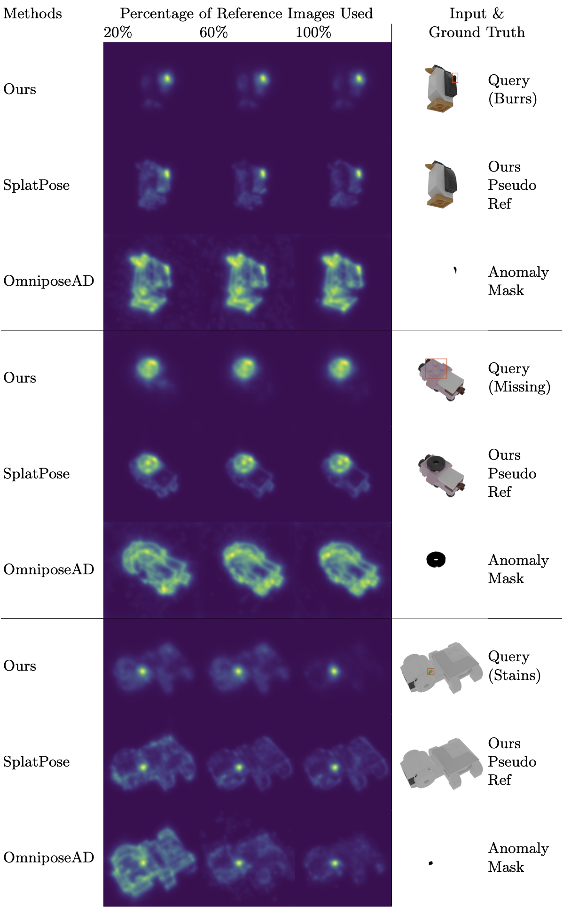

# SplatPose+: Real-time Image-Based Pose-Agnostic 3D Anomaly Detection
This is the official code to the paper 
[**"SplatPose+: Real-time Image-Based Pose-Agnostic 3D Anomaly Detection"**](https://arxiv.org/abs/2410.12080) 
by Yizhe Liu, Yan Song Hu, Yuhao Chen, John Zelek, which was accepted to the ECCV 2024 Vision Workshop.




## Abstract:
>Image-based Pose-Agnostic 3D Anomaly Detection is an important task that has emerged in industrial quality control. This task seeks to find anomalies from query images of a tested object given a set of reference images of an anomaly-free object. The challenge is that the query views (a.k.a poses) are unknown and can be different from the reference views. Currently, new methods such as  OmniposeAD and SplatPose have emerged to bridge the gap by synthesizing pseudo reference images at the query views for pixel-to-pixel comparison. However, none of these methods can infer in real-time, which is critical in industrial quality control for massive production. For this reason, we propose SplatPose+, which employs a hybrid representation consisting of a Structure from Motion (SfM) model for localization and a 3D Gaussian Splatting (3DGS) model for Novel View Synthesis. Although our proposed pipeline requires the computation of an additional SfM model, it offers real-time inference speeds and faster training compared to SplatPose. Quality-wise, we achieved a new SOTA on the Pose-agnostic Anomaly Detection benchmark with the Multi-Pose Anomaly Detection (MAD-SIM) dataset.  


## Installation Setup
We have only tested on a Linux machine.

```shell
# (1) Cloning the repository and the submodules recursively
git clone git@github.com:Yizhe-Liu/SplatPosePlus.git --recursive
cd SplatPosePlus

# (2) Create the environment with necessary CUDA & PyTorch frameworks
conda env create --file environment.yml 
conda activate splatposeplus

# (3) Download MAD-Sim Dataset
gdown 1XlW5v_PCXMH49RSKICkskKjd2A5YDMQq
unzip MAD-Sim.zip

# (4) Download the pretrained model checkpoints from the PAD repository
cd PAD_utils
gdown https://drive.google.com/uc\?id\=16FOwaqQE0NGY-1EpfoNlU0cGlHjATV0V
unzip model.zip
cd ..
```

### Running Anomaly Detection
To run SplatPose+ on the first class "01Gorilla" of MAD, simply run
```shell
python train_render_eval.py -c 01Gorilla
```
Run ```python train_render_eval.py --help``` to find other options and flags. 


### Credits
Our work is based on the following works: 
- [SplatPose](https://github.com/m-kruse98/SplatPose)
- [3D Gaussian Splatting for Real-Time Radiance Field Rendering](https://github.com/graphdeco-inria/gaussian-splatting)
- [PAD: A Dataset and Benchmark for Pose-agnostic Anomaly Detection](https://github.com/EricLee0224/PAD)
- [Hierarchical-Localization](https://github.com/cvg/Hierarchical-Localization)

### License
The gaussian-splatting module is licensed under the respective "Gaussian-Splatting License" found in LICENSE.md.
